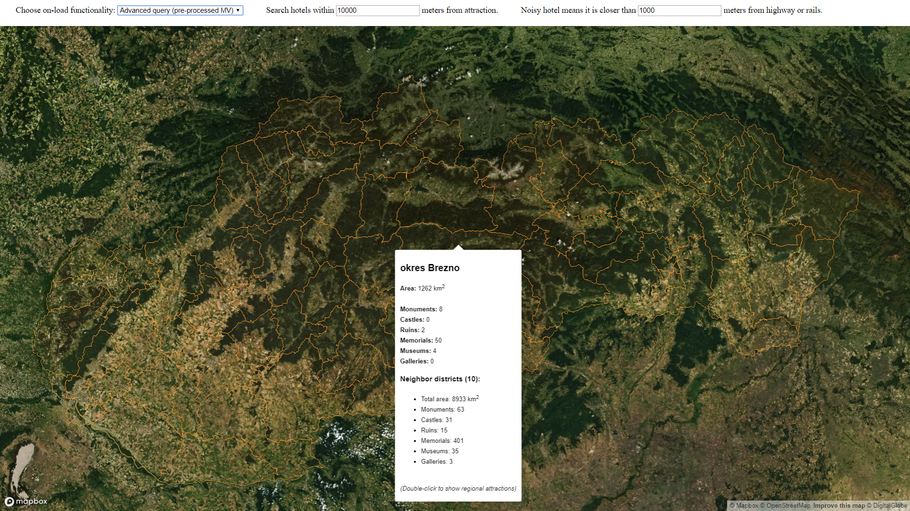

# Overview

This application shows districts of Slovakia along with interesting places recalling Slovak history. Those are namely: monuments, castles, ruins, memorials, museums and galleries. Provided features are:

- map all Slovak districts to appropriate place on a map and provide either basic or more complex information about them
- list all interesting places recalling Slovak history in a selected district
- search places to sleep near selected interesting place (hotels, motels, guest houses)
- calculate distance to the nearest highway or rails from the place to sleep to express a place noisiness

This is it in action:


The application has 2 separate parts, the client which is a [frontend web application](#frontend) using mapbox API and mapbox.js and the [backend application](#backend) written in [Express](https://expressjs.com/), backed by PostGIS. The frontend application communicates with backend using a [REST API](#api).

# Frontend

The frontend consists of a single HTML page `index.html`, that uses a JavaScript widget to display map layers. We use our own designed map style, which is basically adjusted Basic Template provided by Mapbox. Satellite layer was added with linear transformation to basic streets layer, most of the backgound colors were updated to make it easier to distinguish more landuses and different type of roads.

The top of a screen provides basic interaction with API calls by 2 numeric input fields and 1 select field (on-load functionality and distance within specific types of objects that is used to search for them in backend).

File `index.html` also contains JavaScript to handle all events. The most of them are map events that are fired by Mapbox by default (load, click, double click, mouse move, mouse leave). However, we added a listener into the select field, mentioned above, that just generates Mapbox load event upon change of the selected item. Other input fields serve only to adjust the API calls and are not handled by any listeners. Therefore, their values are used when appropriate  API is called (that is, when user generates events on appropriate map layer).

The goal of map events listeners is to:

- call appropriate API, wait for response and use it to fill appropriate map layer
- display data stored in the given map layer

# Backend

The backend application is quite simple. It is written in Node.js framework called Express and is responsible for querying geo data and formatting the geojson.

## Data

We loaded data from Open Street Maps covering whole Slovakia into PostGIS (extension of Postgres) using osm2pgsql tool. Application uses all of the three geometry types (point, line, polygon).

Additionally, we created materialized view for one of the scenarios (get extended district stats) as it uses static query (can't be affected by user) and it's run time is quite long even though indexes were provided.

The query to create materialized view:

```
CREATE MATERIALIZED VIEW extended_regional_stats AS

WITH district_stats AS (
  SELECT
    districts.way AS way,
    ROUND(ST_Area(ST_Transform(districts.way, 2163)) / 1000000) AS area,
    name,
    osm_id,
    COUNT(*) FILTER (WHERE type = 'monument') AS monuments,
    COUNT(*) FILTER (WHERE type = 'castle') AS castles,
    COUNT(*) FILTER (WHERE type = 'ruins') AS ruins,
    COUNT(*) FILTER (WHERE type = 'memorial') AS memorials,
    COUNT(*) FILTER (WHERE type = 'museum') AS museums,
    COUNT(*) FILTER (WHERE type = 'gallery') AS galleries
  FROM
  (
    SELECT
      way,
      name,
      osm_id
    FROM
      planet_osm_polygon
    WHERE
      name LIKE 'okres %'
  ) districts
  LEFT JOIN
  (
    SELECT
      way,
      COALESCE(historic, tourism) AS type
    FROM
      planet_osm_point
    WHERE
      historic IN ('monument', 'castle', 'ruins', 'memorial')
      OR tourism IN ('museum', 'gallery')
  ) attractions
  ON
    ST_Contains(districts.way, attractions.way)
  GROUP BY
    1,2,3,4
)

SELECT
  ST_AsGeoJSON(ST_Transform(ds1.way, 4326)) AS geo,
  ds1.area,
  ds1.name,
  ds1.osm_id,
  ds1.monuments,
  ds1.castles,
  ds1.ruins,
  ds1.memorials,
  ds1.museums,
  ds1.galleries,
  COUNT(*) AS neighbors,
  SUM(ds2.area) AS neighbor_area,
  SUM(ds2.monuments) AS neighbor_monuments,
  SUM(ds2.castles) AS neighbor_castles,
  SUM(ds2.ruins) AS neighbor_ruins,
  SUM(ds2.memorials) AS neighbor_memorials,
  SUM(ds2.museums) AS neighbor_museums,
  SUM(ds2.galleries) AS neighbor_galleries
FROM
  district_stats ds1
LEFT JOIN
  district_stats ds2
ON
  ST_Touches(ds1.way,ds2.way)
GROUP BY
  1,2,3,4,5,6,7,8,9,10
```

## Indexes

Following indexes were provided:

```
-- non-geo indexes
CREATE INDEX polygon_name_idx ON planet_osm_polygon (name varchar_pattern_ops);
CREATE INDEX point_historic_idx ON planet_osm_point (historic);
CREATE INDEX point_tourism_idx ON planet_osm_point (tourism);
CREATE INDEX point_tourism_idx ON planet_osm_point (tourism);
CREATE INDEX line_railway_idx ON planet_osm_line (railway);
CREATE INDEX line_name_idx ON planet_osm_line (name varchar_pattern_ops);

-- non-geo indexes (default)
CREATE INDEX planet_osm_point_pkey ON planet_osm_point (osm_id);
CREATE INDEX planet_osm_line_pkey ON planet_osm_line (osm_id);
CREATE INDEX planet_osm_polygon_pkey ON planet_osm_polygon (osm_id);

-- geo indexes (default)
CREATE INDEX planet_osm_point_index ON gist(way);
CREATE INDEX planet_osm_line_index ON gist(way);
CREATE INDEX planet_osm_polygon_index ON gist(way);
```

## Api

**Find all Slovak districts with their area in square kilometres**

`GET /api/get-regions`

**Find all Slovak districts with their area in square kilometres, count of interesting places in district, count of neighboring districts and sum of their area in square kilometres along with sum of counts of interesting places**

`GET /api/get-regions-advanced`

**Find interesting places in a district**

`POST /api/get-local-attractions`

Request body parameters:

- osm_id: osm id of a district

**Find places to sleep withing given range from interesting place with distance to closest highway or rails**

`POST /api/get-nearby-hotels`

Request body parameters:

- osm_id: osm id of an interesting place
- distance_hotel_attraction: range in meters to search for places to sleep around interesting place
- distance_hotel_road: range in meters to search for highways and rails around place to sleep

# Scenarios

## Get basic info about district

After loading the map, client sends `GET /api/get-regions` to get all districts with basic info and maps them to `regions-layer` of the map.
By moving mouse onto this layer, popup with show providing requested information (name, area).


Example query:
```
SELECT
  ST_AsGeoJSON(ST_Transform(way, 4326)) AS geo,
  ROUND(ST_Area(ST_Transform(way, 2163)) / 1000000) AS area,
  name,
  osm_id 
FROM
  planet_osm_polygon
WHERE
  name LIKE 'okres %'
```

## Get extended info about district

User can choose to get more info about districts in the top of the screen. This causes that `regions-layer` will be re-filled by data from calling `GET /api/get-regions-advanced`.


Example query (on materialized view - see [DATA](#data)):
```
SELECT
  * 
FROM
  extended_regional_stats
```

## List interesting places recalling Slovak history in a given district

Double-clicking on `regions-layer` will cause client to call `POST /api/get-local-attractions`, and store the result into `attractions-layer`. Places will be displayed as corresponding icons with blue heading on a map.
By moving mouse onto icons, name and type of the place will be displayed in popup.


Example query:
```
WITH district AS
(
  SELECT
    way
  FROM
    planet_osm_polygon
  WHERE
    osm_id = '-388241'
)

SELECT
  ST_AsGeoJSON(ST_Transform(way, 4326)) AS geo,
  name,
  COALESCE(historic, tourism) AS type,
  osm_id
FROM
  planet_osm_point
WHERE
  (historic IN ('monument', 'castle', 'ruins', 'memorial')
    OR tourism IN ('museum', 'gallery'))
  AND ST_Within(way, (SELECT way FROM district))
```

## List places to sleep around selected interesting place and find out how far is the nearest noise source (highway, rails)

By clicking on `attractions-layer`, client will call `POST /api/get-nearby-hotels`. Before that, user can choose how far from selected place, places to sleep should be searched and how far from them noise source should be searched. Client loads the response into `hotels-layer` and displays places to sleep as icons with red heading.
By moving mouse onto this layer, popup will show providing user with place name, type and distance to nearest noise source (if found within the given radius).


Example query:
```
WITH attraction AS
(
  SELECT
    way
  FROM
    planet_osm_point
  WHERE
    osm_id = '3729756978'
)

SELECT
  ST_AsGeoJSON(ST_Transform(hotel.way, 4326)) AS geo,
  name,
  tourism,
  ROUND(MIN(ST_Distance(hotel.way, noise_source.way))) AS distance_to_noise
FROM
(
  SELECT
    way,
    name,
    tourism
  FROM
    planet_osm_point
  WHERE
    tourism IN ('hotel', 'motel', 'guest_house')
    AND ST_DWithin(way, (SELECT way FROM attraction), 30000)
) hotel
LEFT JOIN
(
  SELECT
    way
  FROM
    planet_osm_line
  WHERE
    name LIKE 'D_'
    OR name LIKE 'R_'
    OR railway IN ('rail', 'tram')
) noise_source
ON
  ST_DWithin(hotel.way, noise_source.way, 3000)
GROUP BY
  1,2,3
```

